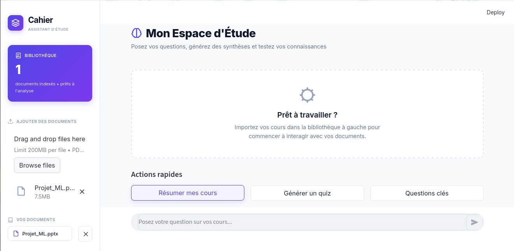
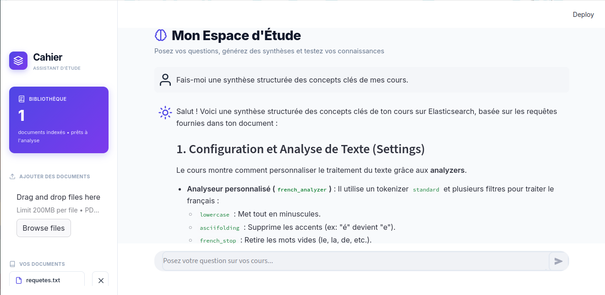

# Cahier — Assistant IA pour étudiants (RAG)

Assistant intelligent qui permet à un étudiant d'importer ses cours (PDF, Word, PowerPoint, TXT) et de poser des questions en langage naturel, avec des réponses sourcées directement à partir du contenu importé.




## Fonctionnalités

- **Import multi-format** : PDF, Word (.docx), PowerPoint (.pptx), TXT
- **Recherche sémantique** : retrouve les passages pertinents par sens, pas seulement par mot-clé
- **Réponses sourcées** : chaque réponse cite le document et la page/slide d'origine
- **Confidentialité** : les embeddings sont générés localement, aucune donnée de cours n'est stockée sur un serveur tiers
- **Gestion de bibliothèque** : ajout et suppression individuelle de documents

## Architecture
```
Upload (PDF/Word/PPT/TXT)
↓
Extraction de texte (pdfplumber / python-docx / python-pptx)
↓
Découpage en chunks (avec chevauchement)
↓
Embeddings locaux (Ollama — nomic-embed-text)
↓
Stockage vectoriel (ChromaDB)
↓
Question → recherche sémantique → prompt augmenté → génération (Gemini API)
↓
Réponse + sources affichées dans l'interface (Streamlit)
```
## Stack technique

| Composant | Technologie |
|---|---|
| Interface | Streamlit |
| Extraction de texte | pdfplumber, python-docx, python-pptx |
| Embeddings | Ollama (nomic-embed-text) — 100% local |
| Base vectorielle | ChromaDB |
| Génération de réponses | API Gemini (Google AI Studio) |

## Installation

### Prérequis
- Python 3.12+
- Ollama installé et démarré (https://ollama.com)
- Une clé API Gemini (https://aistudio.google.com)

### Étapes

```bash
git clone https://github.com/Herizo3101/cahier-ai-.git
cd cahier-ai-

python -m venv venv
source venv/bin/activate

pip install -r backend/requirements.txt
pip install -r frontend/requirements.txt

ollama pull nomic-embed-text

echo "GEMINI_API_KEY=ta_clé_ici" > .env
```

### Lancement

```bash
cd frontend
streamlit run app.py
```

L'application est accessible sur `http://localhost:8501`.

## Structure du projet
```
RAG/
├── backend/
│   ├── ingestion.py       # Extraction de texte (PDF/Word/PPT/TXT)
│   ├── chunking.py        # Découpage en chunks
│   ├── vectorstore.py     # Embeddings + ChromaDB
│   ├── rag.py             # Pipeline retrieval + génération
│   └── requirements.txt
├── frontend/
│   ├── app.py             # Interface Streamlit
│   └── requirements.txt
├── data/
│   └── chroma_db/         # Base vectorielle persistante
└── uploads/                # Fichiers temporairement uploadés
```
## Auteur

LinkedIn : linkedin.com/in/sedraniaina-herizo-8a22843b3

GitHub : github.com/Herizo3101
